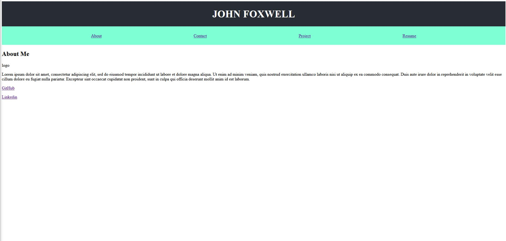

# React-Portfolio
Personal portfolio created using React


## Description
Main Topic: React

This is a simple porfolio built using React. Key focus points of this project is understand how React works by breaking up parts of a webpage/interface into components that can be reused throughout the app and other apps. Inside of using Vanillia javascript to complete this project which would involve one massive script file, React is used to house several small JS files with each file being its on component. Also vanilla javascript would require a manual page load whenever a state changes but with React this is done automatically.


## Screenshot



## Link
[Click here](https://johnfoxwell.github.io/React-Portfolio/)


## Developed by:
```
John Foxwell
```
